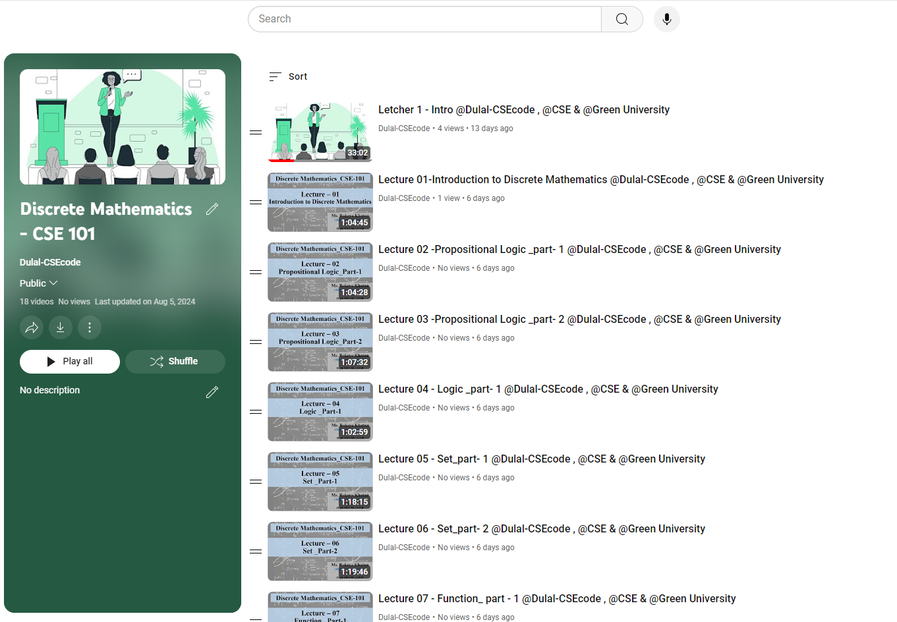

<h1 align="center">--- Discrete-Mathematics-CSE-101 ---</h1>  
<h3 align="center">-- Fall 2021 --</h3>  
<br />  
Welcome to the Discrete Mathematics CSE-101 repository. This repository contains course materials, assignments, and resources for the Discrete Mathematics CSE-103 course.  
<br />  



  
<br />  

## Table of Contents
- [Introduction](#introduction)
- [Course Outline](#course-outline)
- [Installation](#installation)
- [Prerequisites](#prerequisites)
- [Assignments and Practice Problems](#assignments-and-practice-problems)
- [Usage](#usage)
- [Contributing](#contributing)
- [License](#license)

## Introduction

In this course, we will cover the fundamental concepts of Discrete Mathematics CSE-103, including logic, set theory, functions, mathematical induction, graph theory, and more. The repository provides a comprehensive guide to understanding and applying these principles through problem-solving.

Check out the playlist now and start your learning journey: [ Playlis Link ](https://youtube.com/playlist?list=PLEc-WcPXUsjuZyBh8ofWRW4QvKDhjmpYk&si=1bJMDC1fiyBbgkg8)
**Happy Learning!**

In this course, we will cover the fundamental concepts of Discrete-Mathematics---CSE-101, including logic, set theory, functions, mathematical induction, graph theory, and more. The repository provides a comprehensive guide to understanding and applying these principles through problem-solving.

## Course Outline

### 1. Socialization and Introduction to the Course
- Overview of course objectives and structure.

### 2-3. Logic
- **Propositional Logic** (PPT-1)
  - Basic Problems: Page-12 (1-20), Page-22 (1-20)
  - Composite Statements: PPT-1 Page-6
  - Logical Connectives: PPT-1 Page-(4-9)
  - Application of Propositional Logic: PPT-1 1.2
- **CO1**

### 4-5. Advanced Logic
- **Predicate Logic** (PPT-2)
  - Problems: Page-78 (1-9)
  - Limitation of Propositional Logic
  - Quantifiers: PPT-2 1.4
  - Rule of Inference: PPT-2 1.6
- **CO1**

### 6-8. Set Theory
- **Set Operations** (PPT-3)
  - Problems: Page-125 (1-44), Page-136 (1-29)
  - Basic Discrete Structures: PPT-3 2.1
  - Cardinality, Infinite Set, Power Set, Cartesian Product
  - Set Operations and Computer Representation: PPT-3 Page-134
- **CO1**

### 9-11. Functions
- **Functions and Their Representations** (PPT-4)
  - Problems: Page-152 (1-6)
  - Injective, Surjective, Bijection Functions
  - Inverse and Composition of Functions: PPT-4 Page-145
- **CO1**

### 12. Mathematical Induction
- **Mathematical Proof Techniques** (PPT-5)
  - Problems: Page-329 (1-2), Page-451 (1-24)
- **CO2**

### 13. Discrete Probability
- **Probability Theory** (Chapter-7)
  - Discrete Probability, Uniform Probability Measure
  - Probability of Complementary and Union Events: PPT-6 Page-455
- **CO2**

### 14-16. Graph Theory
- **Introduction to Graphs** (PPT-6)
  - Problems: Page-649 (1-10), Page-665 (1-58), Page-675 (1-18)
  - Directed, Undirected, Complete, Bipartite Graphs
  - Subgraph and Graph Representation: PPT-6 Page-663
- **CO1, CO3**

### 17-18. Trees
- **Tree Structures** (PPT-7)
  - Problems: Page-755 (1-33)
  - Rooted, M-ary, Binary, Complete Binary Trees
- **CO1, CO3**

### 19-20. Counting Techniques
- **Combinatorics and Counting Rules** (PPT-8)
  - Problems: Page-413 (1-38)
  - Inclusion-Exclusion Principle, Pigeonhole Principle, Permutations, Combinations
  - Caesar Cipher: PPT-8 6.1
- **CO2**

### 21-22. Basic Number Theory
- **Introduction to Number Theory** (PPT-9)
  - Problems: Page-284 (1-8), Page-284 (1-10)
  - Divisors, Prime Numbers, Fundamental Theorem of Arithmetic
  - GCD, Relatively Prime, LCM, Mod Function
- **CO1, CO3**

### 23-24. Relations
- **Binary Relations** (PPT-10)
  - Problems: Page-579 (1-16)
  - Reflexive, Symmetric, Transitive Relations, Closure, Composite and Equivalence Relations
- **CO1**

## Installation

To set up the environment:

1. Clone the repository:
   ```bash
   git clone https://github.com/Dulal-CSEcode/Discrete-Mathematics---CSE-101.git
   cd Discrete-Mathematics---CSE-101
    ```

2. Install any required packages or dependencies. For example, on a Debian-based system:

    ```bash
    sudo apt-get update
    sudo apt-get install build-essential
    ```
## Prerequisites

Before you begin, ensure you have met the following requirements:

- You have a basic understanding of programming concepts.
- You have access to a C/C++ compiler.
- You have a basic understanding of C/C++ programming.
- You have Git installed on your computer.

## Assignments and Practice Problems

This repository includes a collection of assignments and practice problems to help reinforce the concepts taught in the course. Each assignment is located in its respective directory with detailed instructions and resources.

## Usage
Navigate to the specific assignment or practice problem directory and follow the instructions provided in the README.md file located in each folder.

## Contributing
Contributions are welcome! To contribute, please follow these steps:

1. Fork the repository.

2. Create a new branch (e.g., feature-branch).

3. Make your changes and commit them (git commit -m 'Add new feature').

4. Push to the branch (git push origin feature-branch).

5. Create a pull request.

Please ensure your code follows the repository's coding standards and includes appropriate tests.

## License
This project is licensed under the MIT License. See the LICENSE file for more details.


<br/>
<h2 align="center"> Thanks for visiting the Discrete-Mathematics---CSE-101.</h2>
<h3 align="center">© All rights reserved by Dulal-CSEcode @2024 © Department of Computer Science and Engineering, GUB </h3>


   
